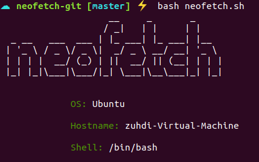

# Simple Neofetch
**note**: only for linux users :)

***


***

Installation:
```sh
git clone https://github.com/uwuntudev/simple-neofetch.git neofetch
cd neofetch
bash ./neofetch.sh # use the bash script file
```

Enjoy :)
